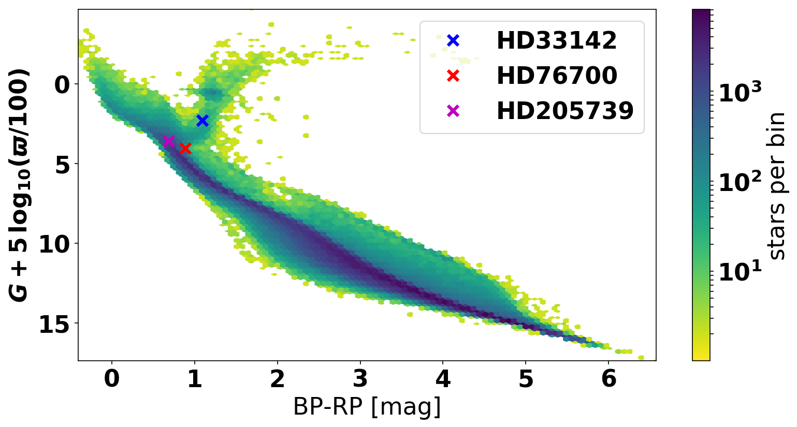

# CMDprior
These jupyter notebooks lay out how to simply generate Galaxy priors using the [GDR2mock](http://adsabs.harvard.edu/abs/2018PASP..130g4101R) catalogue and they can also help to get a quick interface with the [isochrones](https://github.com/timothydmorton/isochrones) and [brutus](https://github.com/joshspeagle/brutus) isochrone fitting packages.

# Running the jupyter notebooks
In order to run those jupyter notebooks on your local machine you will need to install a few necessary packages. You will also need some additional data in the data folder in order to run the brutus package. If you do not want to run the ADQL-TAP queries yourself, you can download the GDR2mock samples used in the notebooks together with the brutus data from [here](https://keeper.mpdl.mpg.de/d/51feb58454a5450f9cf4/).

# Example science case
In particular they were used in the following science paper: Arxiv reference

# Attribution
If you use those notebooks in your science please cite: ASCL reference
Also cite the relevant packages and catalogues used.

CMD prior for the planetary host stars from the paper. This shows the CMD of all stars within 130 pc in GDR2mock catalogue.
